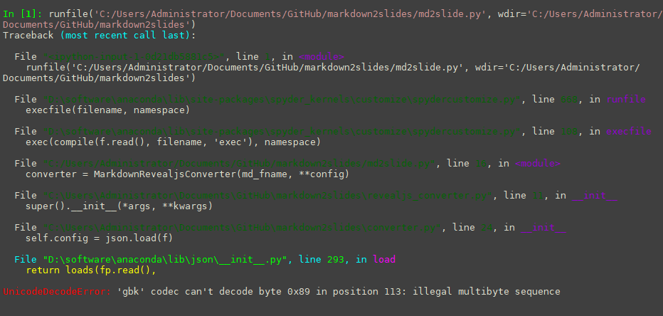
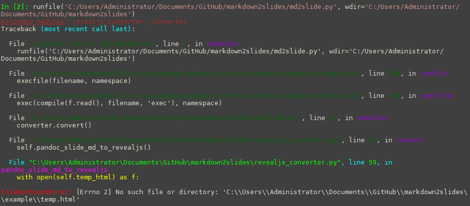
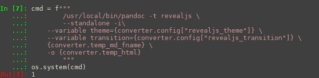
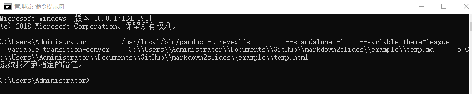
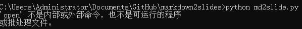
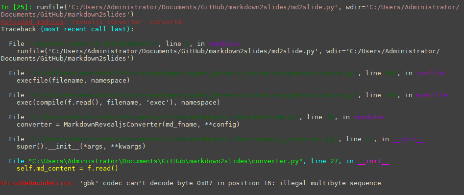
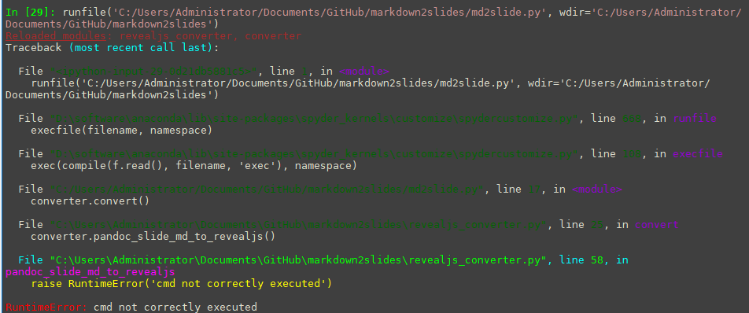
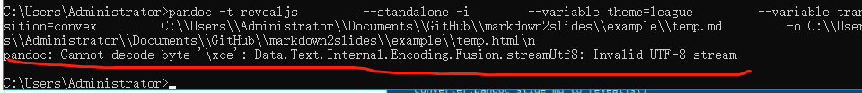
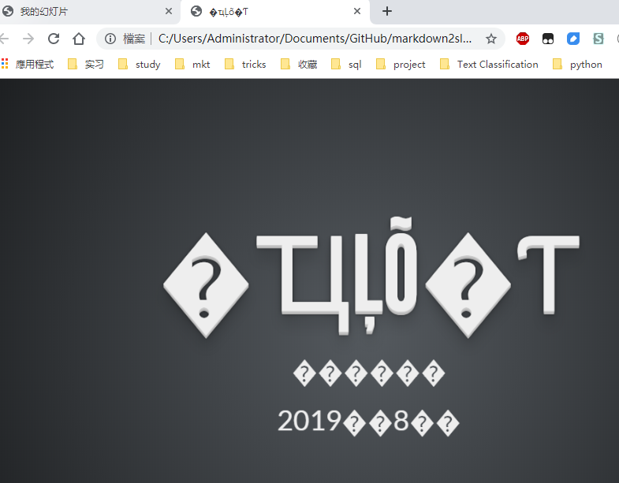
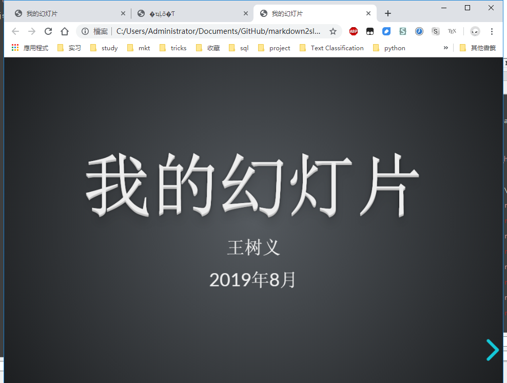

# markdown2slides
Tools for converting Markdown Source File to Reveal.js HTML5 slides

## Usage:

1. Install Anaconda 3
2. Install Pandoc
3. Clone this github repo
4. cd into the directory markdown2slides
5. Open config.json, and change the information according to your situation
6. run python3 md2slide.py example/myslide.md


I downloaded it on my windows 10, but I can't simply make it works by one command

```
python3 md2slide.py example/myslide.md
```

I did some modification as I encounter these errors in the way of making it works


### Error  1



### solution 1

line 23 of converter.py

```diff
-      with open(config_json_fname) as f:
+      with open(config_json_fname, encoding = 'utf-8') as f:
            self.config = json.load(f)
```


### Error 2



### solution 2

This error happens because you the temp.html did not correctly generate and python would not alert you even the cmd line was not execute correctly 

Here is the comparison







### Solution 2

line50 of revealjs_converter.py

```diff
-      cmd = f"""/usr/local/bin/pandoc -t revealjs \
+      cmd = f"""pandoc -t revealjs \
```

Before that, make sure you can run "pandoc -v" correctly in you cmd

ps: 

```diff
- os.system(cmd):
+ if os.system(cmd):
+ 	raise RuntimeError('cmd not correctly executed')
```


### Error 3



### solution 3

```diff
- cmd = f"open {self.output_html}"
+ cmd = f"start {self.output_html}"
```


### Error 4

Now it's seems to be totally okay that the files was correct generate, but I do meet another error when it comes to using Chinese in myslider.md





### Solution 4

Firstly 

line 26 of converter.py

```diff
- with open(self.source_md_fname) as f:
+ with open(self.source_md_fname, encoding='utf-8') as f:
```


And then I meet the another error

### Error 4.1



The cmd command didn't correctly executed

more exactly




### Solution 4.1

This error really took me a while to solve, firstly I thinking  about it was something like the character problem you would meet when you using pandoc to transform tex file to pdf but it not , the true bug it's in process of encoding, not decoding


line 48 of revealjs_converter.py

```diff 
- with open(self.temp_md_fname, 'w') as f:
+ with open(self.temp_md_fname, 'w', encoding='utf-8') as f:
```


ps: I firstly add encoding='utf-8' in MarkdownConverter.generate_temp_md() , but it's never been used , it kind of buggy

furthermore 

line 58 of revealjs_converter.py

```diff
- with open(self.temp_html) as f:
+ with open(self.temp_html, encoding='utf-8') as f:
```


Finally 

the same problem as solution1




fix 

line 77 of revealjs_converter.py

```diff
- with open(self.output_html, 'w') as f:
+ with open(self.output_html, 'w', encoding='utf-8') as f:
```


And I finally got it works




### suggestions

* try to put encoding = 'utf-8' in every reading and writing snippets if u need
* you can add error raise to os.system since it won't alert